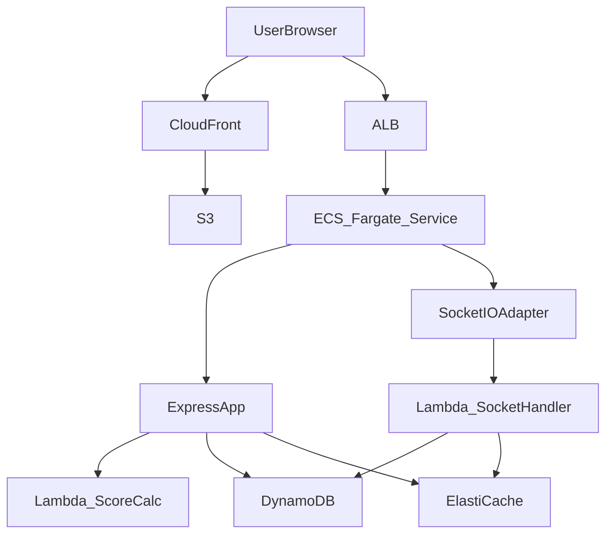

# アーキテクチャ設計

## 1. 論理構成図

```mermaid
flowchart LR
  subgraph Client
    A[Next.js (React) + Suspense]
  end

  subgraph Frontend
    A -->|WebSocket| B[API Gateway WebSocket]
    A -->|REST| C[API Gateway (HTTP)]
  end

  subgraph Backend
    B --> D[Lambda SocketHandler]
    C --> E[Express on Fargate]
    D --> F[TetrisGameManager (RoomManager)]
    E --> F
    F --> G[DynamoDB: GameState]
    F --> H[ElastiCache Redis: Session/Cache]
    E --> I[Lambda ScoreCalc]
  end

  subgraph Infrastructure
    C & B --> J[ALB]
    J --> K[ECS Fargate Cluster]
    E --> K
    D & I --> L[AWS Lambda]
    G --> M[DynamoDB]
    H --> N[ElastiCache]
    A --> O[S3: 静的アセット]
  end
```

## 2. 物理構成図



## 3. コンポーネント説明

- Next.js + Suspense  
  フロントエンド。初期データ取得は Suspense/SWR で非同期レンダリング。  
- API Gateway (WebSocket)  
  Socket.IO のエンドポイント。リアルタイム通信を Lambda で処理。  
- API Gateway (HTTP)  
  一部管理用エンドポイント (部屋一覧取得など)。Express on Fargate で実装。  
- Lambda SocketHandler  
  WebSocket イベントを処理し、RoomManager にルーティング。  
- Express on Fargate  
  永続的 API と管理画面用。ECS Fargate 上で稼働。  
- RoomManager / TetrisGameManager  
  ゲームロジックを管理。DynamoDB/Redis と連携しステートを保持。  
- Lambda ScoreCalc  
  ライン消去時のスコア計算をサーバレスで実行 (非同期バッチ処理)。  
- DynamoDB  
  永続的なゲームステートとルーム情報を格納。  
- ElastiCache Redis  
  セッション／キャッシュ／一時的ペナルティ管理に利用。  
- S3 + CloudFront  
  静的ファイル (次世代アセット) 配信。

---
